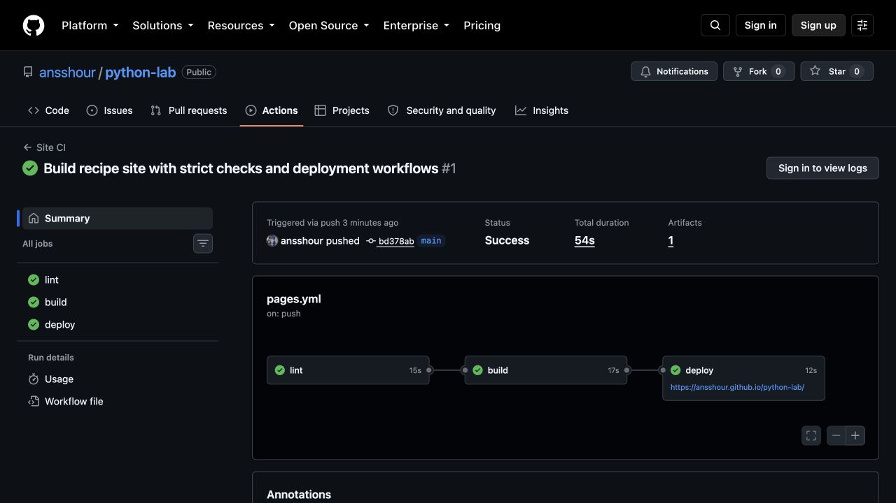
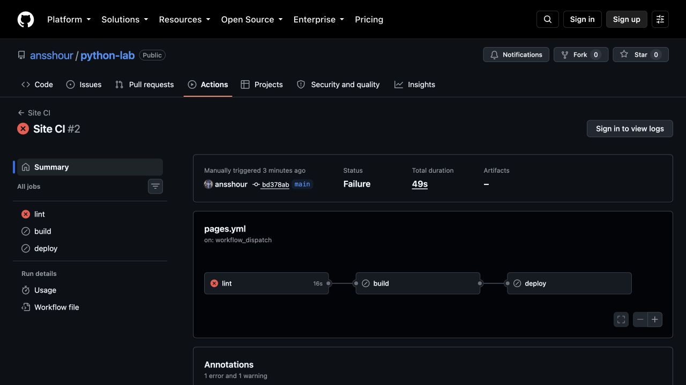
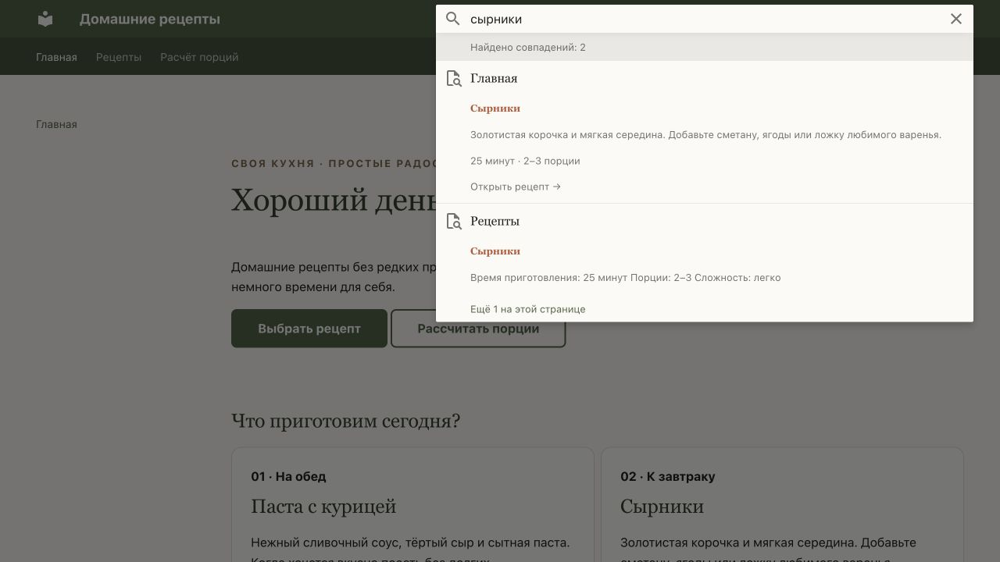
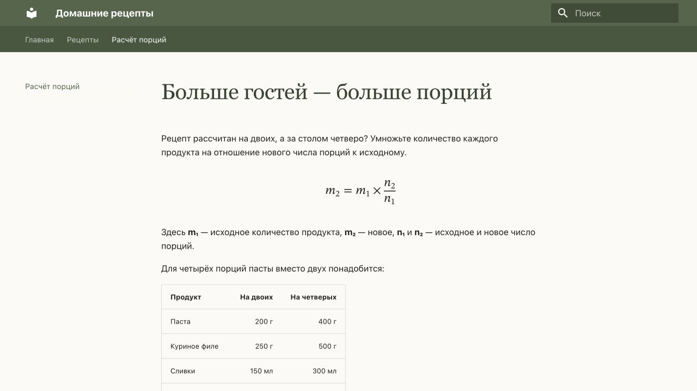

# Публикация сайта «Домашние рецепты»

**Лабораторная работа · T3 + P1 + челлендж · 18 сентября 2026 года**

## 1. Результат и границы выполненной работы

Создан небольшой сайт с рецептами, поиском и формулой пересчёта порций.
Он собирается автоматически и опубликован на GitHub Pages. Для GitVerse
подготовлен отдельный пайплайн доставки на Helios. Отдельный action опубликован
как репозиторий и версионный релиз и проверен на настоящем временном SSH-сервере.

**Работа пока не полностью закрывает задание:** нет доступа к GitVerse и Helios,
поэтому запуск на отечественной платформе, её замеры и публикация на Helios
не выполнены. Листинг Marketplace также не опубликован. Ниже эти пункты
отделены от реально полученных результатов.

| Результат | Ссылка или статус |
| --- | --- |
| Репозиторий сайта | [ansshour/python-lab](https://github.com/ansshour/python-lab) |
| Опубликованный сайт | [GitHub Pages](https://ansshour.github.io/python-lab/) |
| Репозиторий action | [ansshour/helios-deploy-action](https://github.com/ansshour/helios-deploy-action) |
| Версионный выпуск | [v1.0.0](https://github.com/ansshour/helios-deploy-action/releases/tag/v1.0.0), также создан тег `v1` |
| Успешная публикация | [Запуск Site CI](https://github.com/ansshour/python-lab/actions/runs/35355006335) |
| Публикация после обновления Actions | [Повторная проверка](https://github.com/ansshour/python-lab/actions/runs/35355538343) |
| Намеренно проваленный запуск | [Битая ссылка](https://github.com/ansshour/python-lab/actions/runs/35355042681) |
| Измерение кэша | [Dependency benchmark](https://github.com/ansshour/python-lab/actions/runs/35355038881) |
| Реальное использование action | [Интеграционный запуск](https://github.com/ansshour/python-lab/actions/runs/35355538269) |
| Репозиторий GitVerse и сайт Helios | Не созданы: ожидают данных аккаунтов |
| GitHub Marketplace | Требуется завершить оформление через авторизованный браузер |


## 2. Выбор генератора

Исходный проект уже использовал MkDocs Material. Тема рецептов сохранена по
согласованию. Полное условие T1 не было предоставлено, поэтому ниже — краткое
обоснование выбора, а не заявление о выполнении неизвестных требований T1.

| Генератор | Что удобно | Что потребуется для этой работы |
| --- | --- | --- |
| MkDocs + Material | Markdown, один файл настроек, готовые навигация и поиск | Небольшой CSS и страницы с рецептами |
| Sphinx | Ссылки между разделами, документация API, вывод в HTML и LaTeX | Дополнительная настройка для небольшого бытового сайта |
| Hugo | Отдельный исполняемый файл, темы, разные форматы вывода | Выбор темы и отдельная настройка поиска |

Для текущего небольшого сайта выбран **MkDocs 1.6.1 + Material 9.7.7**.
Это оценка удобства, а не сравнительный тест скорости генераторов.
Источники: [MkDocs](https://www.mkdocs.org/),
[Sphinx](https://www.sphinx-doc.org/en/master/),
[Hugo](https://gohugo.io/about/features/).

## 3. Ход работы

### Окружение и зависимости

В системе команда `python3` запускала Python 3.11.7. При этом Python 3.14.7
уже был установлен через Homebrew. Для проекта выбран именно он, версия
записана в `.python-version`. Повторная установка системного Python не нужна.
На дату проверки это актуальная версия по [странице Python](https://www.python.org/downloads/macos/).

`pip` проверен. Отсутствующий `virtualenv` установлен в изолированное окружение
через `uv tool run`; проверена версия 21.7.14 и создано временное окружение
на Python 3.14.7 с pip 26.2.1. Рабочее `.venv` затем синхронизировано через `uv`.
Каркас сайта уже существовал: сохранены рецепты, добавлены оформление и расчёт порций.

Команды для повторения из чистого каталога проекта:

```sh
uv tool run --from virtualenv==21.7.14 virtualenv --python python3.14 .venv
source .venv/bin/activate
python --version
python -m pip --version
python -m pip install --require-hashes -r requirements.txt
python -m mkdocs serve --dev-addr 127.0.0.1:8017
python -m mkdocs build --strict
```

Рекомендации по установке: [virtualenv](https://virtualenv.pypa.io/en/latest/installation.html).
Зависимости зафиксированы в `uv.lock`, а `requirements.txt` содержит точные
версии и хеши пакетов. В `.gitignore` включены окружение, `site/`, `_build/`,
кэш и служебные файлы. Образ ОС раннера обновляется платформой, поэтому
фиксация Python и пакетов не означает побайтовую фиксацию всей ОС.

### Сборка и адреса страниц

`SITE_URL` передаётся в `site_url`. Для GitHub используется
`https://ansshour.github.io/python-lab/`, для Helios понадобится его реальный
полный адрес с подкаталогом. Опция `base_url` в MkDocs не задаётся: это название
настройки других генераторов. `use_directory_urls: false` создаёт явные ссылки
на `recipes.html` и `portions.html`, не требующие правил перенаправления сервера.

Для проверки подкаталога выполнена отдельная сборка с адресом
`http://127.0.0.1:8018/recipes/`. Проверены файлы, ссылки, якоря и HTTP-ответы.
Страница `404.html` использует абсолютные пути; проверка учитывает именно
настроенный префикс сайта, а не запрещает все абсолютные ссылки подряд.

`mkdocs build --strict` дополнен `validation.links.anchors: warn` и
`not_found: warn`. Это существенно: в исходной конфигурации отсутствующие
якоря давали `INFO`, и строгая сборка оставалась успешной.

### Публикация на GitHub Pages

Создан публичный репозиторий, файлы закоммичены и отправлены в `main`.
В Pages установлен источник **GitHub Actions**. Бейдж в README ссылается
на реальный workflow, а не на статическую картинку.

| Подход | Что публикуется | Настройка Pages | Особенности |
| --- | --- | --- | --- |
| `peaceiris/actions-gh-pages` | Готовые файлы коммитятся в ветку `gh-pages` | Deploy from a branch | Нужна запись в репозиторий; история исходников и сайта раздельна |
| `upload-pages-artifact` + `deploy-pages` | Архив сборки передаётся сервису Pages | GitHub Actions | Не нужна ветка с HTML; права `pages: write`, `id-token: write` только у deploy |

Использован второй вариант. Официальный процесс описан в
[документации GitHub](https://docs.github.com/en/pages/getting-started-with-github-pages/using-custom-workflows-with-github-pages).

## 4. T3: отечественные CI/CD-платформы

Сведения проверены по официальным документам на дату отчёта. Доступность
документации проверена из текущей сети; надёжность сервисов за длительный
период не измерялась. «Не подтверждено» не означает «возможности нет».

### Раннеры, формат и готовые компоненты

| Критерий | GitVerse | SourceCraft | GitFlic |
| --- | --- | --- | --- |
| Где выполняются задачи | Облачные, локальные и организационные раннеры | Облачные, serverless и пользовательские (self-hosted) воркеры | Агенты сервиса и собственных установок; регистрация агента проекта ограничена редакциями Enterprise, Onpremise, Atlas |
| Файл | `.gitverse/workflows/*.yml` | `.sourcecraft/ci.yaml` | `gitflic-ci.yaml` |
| Устройство | `jobs`, `steps`, `needs`, `uses` | Рабочие процессы, задания, кубики | `stages`, задания, `script`, `rules`, `needs` |
| Близость к GitHub Actions | Высокая на уровне описания; совместимость конкретных действий нужно проверять | Есть запуск Actions через кубики; весь workflow не становится автоматически совместимым | YAML похож на GitLab CI; GitHub workflow нужно переписать |
| Готовые действия | Actions и примеры starter-workflows | Переиспользуемые кубики и GitHub Actions | Шаблоны и переиспользуемые CI-компоненты |
| Важное ограничение | GitHub-специфичные сервисы не переносятся одним копированием YAML | Actions и GitLab-пайплайны запускаются только на облачных воркерах | Не следует считать любой GitLab YAML совместимым без проверки справочника |

Основание: [GitVerse: синтаксис](https://gitverse.ru/docs/cicd/docs/workflow),
[раннеры](https://gitverse.ru/docs/cicd/docs/runners/),
[SourceCraft: CI/CD](https://sourcecraft.dev/portal/docs/ru/sourcecraft/concepts/ci-cd),
[кубики](https://sourcecraft.dev/portal/docs/ru/sourcecraft/ci-cd-ref/cubes),
[воркеры SourceCraft](https://sourcecraft.dev/portal/docs/ru/sourcecraft/concepts/workers),
[GitFlic: агенты](https://docs.gitflic.ru/latest/cicd/agent/),
[YAML](https://docs.gitflic.ru/latest/cicd/gitflic-ci-yaml/),
[компоненты](https://docs.gitflic.ru/latest/cicd/components/).

### Секреты, файлы и бесплатный тариф

| Критерий | GitVerse | SourceCraft | GitFlic |
| --- | --- | --- | --- |
| Секреты | Хранилище платформы, обращения через `secrets` | Секреты и переменные окружения | Переменные задач, интеграции с хранилищами секретов; возможности зависят от редакции |
| Артефакты | Upload/download actions, передача между jobs | Артефакты кубиков и передача данных между заданиями | `artifacts`, зависимости заданий |
| Кэш | `actions/cache`, ключ по файлу зависимостей | Механизм нужно выбирать для конкретного режима кубика; перенос `actions/cache` требует испытания | `cache.paths`, `cache.key` |
| Бесплатное время CI | 1000 мин/месяц для публичных, 500 для приватных репозиториев | Free: 1000 мин/месяц для публичных и приватных репозиториев, до 5 параллельных процессов | Единую актуальную квоту бесплатных облачных минут подтвердить не удалось; уточнить в аккаунте |
| Лимиты файлов | Артефакты: 500 МБ, обычно 30 дней | До 100 МБ артефактов кубика, 10 ГБ на организацию; хранение 14 дней | Определяются редакцией и настройками сервиса |
| Документация: оценка автора | Удобные короткие примеры; версии Actions всё равно надо проверять | Подробные справочники, но больше новых понятий | Подробный YAML-справочник; важно отличать облако от собственной установки |

Источники: [лимиты GitVerse](https://gitverse.ru/docs/cicd/docs/limits/),
[кэш GitVerse](https://gitverse.ru/docs/cicd/manuals/caching/),
[артефакты GitVerse](https://gitverse.ru/docs/cicd/manuals/artifacts/),
[тарифы SourceCraft](https://sourcecraft.dev/portal/docs/ru/sourcecraft/pricing),
[лимиты SourceCraft](https://sourcecraft.dev/portal/docs/ru/sourcecraft/concepts/limits),
[настройки GitFlic](https://docs.gitflic.ru/latest/cicd/cicd-settings/),
[тарификация GitFlic](https://docs.gitflic.ru/latest/company/billing_for_company/).
Бесплатная команда GitFlic до пяти человек не доказывает наличие бесплатного
облачного раннера. Квоты нельзя смешивать с ценой лицензии.

Собственный домен и HTTPS сайта определяются хостингом. Наличие CI само по
себе их не предоставляет. `git push` запускает сборку исходников; готовый
сайт можно затем отправить через SSH или S3 API из любого подходящего раннера.

### Три варианта размещения

| Критерий | Helios ИТМО | Yandex Object Storage | Selectel S3 |
| --- | --- | --- | --- |
| Модель | Учебный сервер и каталог пользователя | Бакет с режимом статического сайта | Публичный бакет с режимом сайта |
| Доставка | SSH, при наличии rsync — синхронизация; SFTP/SCP зависят от сервера | S3 API, например `aws s3 sync` | S3 API; основной вариант — AWS CLI |
| Свой домен | Требует согласования с администратором; не подтверждён для аккаунта | Поддерживается настройкой DNS и бакета | Поддерживается пользовательский домен |
| HTTPS | Зависит от предоставленного публичного адреса; ещё не проверен | Есть HTTPS, для своего домена нужна настройка сертификата | Для пользовательского домена добавляется TLS-сертификат |
| Бесплатный вариант | Учебная учётная запись; размер и срок доступа нужно уточнить | Тарифицируются ресурсы; стартовые льготы не следует считать бессрочным бесплатным хостингом | Тарифицируется хранение и другие ресурсы; бесплатная квота здесь не подтверждена |
| Обслуживание | Правила, квоты и доступ задаёт вуз | Веб-сервер обслуживает провайдер | Веб-сервер обслуживает провайдер |
| Документация и доступность | Найдены учебные материалы, но актуальные параметры аккаунта неизвестны | Подробные инструкции по сайту, доступу и тарифам доступны | Подробные инструкции по бакету, домену и TLS доступны |
| Ограничение для проекта | Без аккаунта нельзя проверить доставку и публичный URL | Требуются облачный аккаунт, бакет и платёжные условия | Требуются аккаунт, бакет и платёжные условия |

Для Helios [учебная памятка ИТМО](https://se.ifmo.ru/~dima/ovt/OVT_Inf_mod.pdf)
описывает SSH; документ старый, поэтому его порт не зашит как обязательный.
Путь `public_html/recipes` в примере action — пример, а не проверенный
путь конкретного пользователя. Не следует угадывать URL по SSH-имени.

Сведения о хостингах: [Yandex: статический сайт](https://yandex.cloud/ru/docs/storage/concepts/hosting),
[тарифы](https://yandex.cloud/ru/docs/storage/pricing),
[Selectel: сайт](https://docs.selectel.ru/s3/buckets/website/),
[домены](https://docs.selectel.ru/s3/manage/manage-user-domains/),
[TLS](https://docs.selectel.ru/s3/manage/tls-ssl-certificates/),
[AWS CLI](https://docs.selectel.ru/s3/tools/aws-cli/).
WebDAV и FTP в этом проекте не используются; их наличие у каждой площадки
не предполагается автоматически. Собственные CI-раннеры, кэш и секреты
к режиму статического хостинга бакета не относятся.

### Сколько стоит перенос workflow

Для P1 выбран **GitVerse**: структура ближе к уже работающему GitHub workflow.
Следующая таблица — плановая оценка труда для небольшого сайта при готовых
аккаунтах, а не замер выполненной миграции.

| Работа | Что переносится | Что меняется | Оценка |
| --- | --- | --- | --- |
| GitHub → GitVerse | Markdown, Python-скрипты, зависимости, команды сборки, схема `needs` | Каталог workflow, `github` → `gitverse`, версии/адреса actions, секреты, доставка на Helios | 2–4 часа |
| GitHub → SourceCraft | Исходники, shell/Python-команды, зависимости | Описание через tasks/cubes, события, условия, передача файлов и режим запуска Actions | 4–8 часов |
| GitHub → GitFlic | Исходники и команды | `gitflic-ci.yaml`, stages/rules, переменные, кэш, артефакты, настройка агента | 4–8 часов |
| Проверка Helios | Статические HTML/CSS/JS | SSH-параметры, ключ сервера, права файлов, полный URL | 1–3 часа после выдачи доступа |

`actions/deploy-pages` и GitHub Pages OIDC нельзя превратить в публикацию
на Helios заменой имени платформы: это другой сервис и другой протокол.
Вместо них используется SSH-action. GitHub environments и разрешения
`pages: write` в отечественный workflow не переносились.

**Практическая тонкость:** GitVerse может обрабатывать также `.github/workflows`.
При импорте проекта нужно отключить GitHub workflows в копии GitVerse и оставить
`.gitverse/workflows/site.yml`, иначе возможны лишние запуски. Сам GitHub
репозиторий менять ради этого не требуется.

## 5. P1: устройство пайплайна

Подготовлен `.gitverse/workflows/site.yml`. Состояние: **реализация готова к
подключению аккаунта, выполнение на GitVerse не проверено**. GitHub-аналог
реально запущен и использован для проверки общей логики.

```text
push / pull_request / ручной запуск
                 │
                 ▼
 lint: орфография → mkdocs --strict → ссылки и HTML
                 │ needs: lint
                 ▼
 build: чистое окружение → зависимости → HTML → артефакт
                 │ needs: build
                 ▼
 deploy: только main, не pull_request
         GitHub Pages / SSH → Helios
```

| Событие | lint | build | deploy |
| --- | --- | --- | --- |
| Push в `main` | Да | После успешного lint | После успешной сборки |
| Push в другую ветку | Да | Да | Пропущен |
| Pull request | Да | Да | Пропущен |
| Ручной запуск в `main` | Да | Да | Да, если проверки прошли |
| Ручной запуск в другой ветке | Да | Да | Пропущен |
| Учебная битая ссылка в GitHub (`break_links=true`) | Завершается ошибкой | Пропущен | Пропущен |
| Push тега | Не запускается основным workflow | — | — |

Дополнительная ветка `codex/verify-build-only` проверена настоящим push:
[запуск](https://github.com/ansshour/python-lab/actions/runs/35355763602)
завершил lint/build успешно, deploy получил `skipped`.
Временные копии сайта также проверены с опечаткой и отсутствующим якорем:
обе ошибки обнаружены, исходные страницы не изменены.

В GitHub используются отдельные jobs и передача артефакта Pages. В GitVerse
build загружает `website`, deploy скачивает именно этот артефакт и отправляет
его на сервер. Повторная сборка в deploy не выполняется.

Кэшируется каталог пакетов, а не `.venv`. Ключ включает ОС, Python и хеш
`requirements.txt`. При изменении зависимостей создаётся другой кэш.
GitHub использует кэш `setup-python`, GitVerse — `actions/cache@v3`, как
в официальном примере платформы. Эти версии не объявляются универсально
совместимыми: проверка на GitVerse ещё предстоит.

Секреты Helios будут переданы только в deploy через Secrets платформы.
В GitHub создан **безвредный случайный тестовый секрет** `LAB_MASK_PROBE`;
в логе получено `Mask probe: ***`. Это доказывает маскирование на GitHub,
но не на GitVerse. Приватный ключ Helios ещё не предоставлялся.

### Успешный и проваленный запуск





В проваленном запуске в рабочую копию раннера добавлена ссылка на
`missing-page.md`. Исходный файл в репозитории не испорчен.
[Полный сохранённый лог](evidence/github-intentional-failure.log) показывает
предупреждение о несуществующем документе, затем остановку строгой сборки.
`build` и `deploy` не выполнялись. После обычного запуска публикация снова успешна.

### Что нужно для завершения P1 на GitVerse

1. Создать репозиторий GitVerse и загрузить проект, отключив в этой копии GitHub workflows.
2. Включить облачный раннер. Проверить доступ к Python 3.14.7, PyPI и используемым actions.
3. Записать переменные `HELIOS_HOST`, `HELIOS_USER`, `HELIOS_PORT`,
   `HELIOS_PATH`, `HELIOS_SITE_URL`. Записать секреты `HELIOS_SSH_KEY` и
   `HELIOS_KNOWN_HOSTS`. Отпечаток сервера сверить с администратором.
4. На Helios проверить rsync, каталог, права и соответствие каталога публичному URL.
5. Запустить main и отдельную ветку, затем намеренно испортить ссылку в учебной ветке.
6. Создать безвредный тестовый секрет `LAB_MASK_PROBE` и запустить
   `.gitverse/workflows/benchmark.yml`: повторить измерение кэша и маскирования именно
   на GitVerse. Добавить его бейдж, ссылки, логи и скриншоты в отчёт.

## 6. Измерения и проверка результата

Замер выполнен `time.perf_counter` вокруг отдельных команд. На одном чистом
GitHub runner созданы два разных пустых окружения; первая установка заполняет
новый каталог pip-кэша, вторая использует его. Так сравнивается установка с
холодным и тёплым **кэшем пакетов**. Время скачивания архива кэша платформы
в этот эксперимент не включено. Это один опыт, не статистическая оценка.

| Операция, Ubuntu 24.04 / Python 3.14.7 | Без кэша, с | С кэшем, с |
| --- | ---: | ---: |
| Установка зафиксированных зависимостей | 10,375 | 7,096 |
| Строгая сборка после установки | 0,500 | 0,412 |
| Установка + сборка | 10,875 | 7,508 |

| Другой замер | Значение | Как измерено |
| --- | ---: | --- |
| Локальная строгая сборка | 0,874 с | Полное время команды, macOS ARM64 |
| Job lint первого успешного CI | 15 с | startedAt / completedAt GitHub API |
| Job build первого успешного CI | 17 с | Включает подготовку и отправку артефакта |
| Job deploy первого успешного CI | 12 с | Включает подготовку и вызов Pages |
| Первый SSH upload в повторном тесте | 2,251 с | Время внутри action, временный сервер |
| SSH upload с `--delete` | 0,508 с | Тот же временный сервер |
| Развёртывание на Helios | Не измерено | Нет доступа |
| Холодный/тёплый запуск GitVerse | Не измерено | Нет аккаунта |

| Ресурс опубликованного сайта | Размер без HTTP-сжатия, байт | HTTP |
| --- | ---: | ---: |
| `index.html` | 17 945 | 200 |
| `recipes.html` | 22 568 | 200 |
| `portions.html` | 15 230 | 200 |
| `search/search_index.json` | 19 341 | 200 |

Это размеры самих ответов HTML/JSON, а не суммарный вес страницы со всеми CSS
и JavaScript. Исходные значения: [время](evidence/github-benchmark.csv),
[размеры](evidence/page-sizes.csv), [jobs](evidence/github-success.json),
[SSH и маскирование](evidence/action-integration-extract.log).

| Проверка | Полученный результат |
| --- | --- |
| Строгая сборка | Успех локально и на чистом GitHub runner |
| Русская орфография | Успех; проверяются словоформы, не стиль и грамматика |
| Внутренние ссылки и якоря | Файлы и якоря существуют |
| Контрольная строка | «Домашние рецепты» найдена в опубликованном HTML |
| Поиск в браузере | Запрос «сырники» выдаёт результаты с правильными ссылками |
| Подкаталог `/recipes/` | Сборка, ссылки и HTTP-проверки проходят |
| Формула без CDN | MathML отображается при CSP, запрещающей внешние ресурсы |
| Маскирование GitHub | Безвредный секрет заменён на `***` |
| Доставка action | Файл совпадает с источником; лишний файл сохраняется без delete и удаляется с delete |





Для проверки CDN использован `scripts/preview_offline.py`: сервер добавляет
`Content-Security-Policy` с разрешением ресурсов только своего origin.
Формула есть непосредственно в HTML; в CSS нет внешних шрифтов. Это проверка
недоступности сторонних ресурсов, а не обещание работы всего сайта без интернета
и предварительной загрузки. Для старых браузеров оставлена текстовая формула.

## 7. Отладка: реальные ошибки

| Ошибка / сообщение | Гипотеза | Проверка | Решение |
| --- | --- | --- | --- |
| `No module named virtualenv` | Модуль отсутствует у выбранного Python | Запуск `python3 -m virtualenv --version` | Изолированная установка и запуск virtualenv 21.7.14 через uv |
| `does not contain an anchor '#сырники'` | Обычный slugifier удаляет кириллицу | В исходном HTML заголовки получили `_1`, `_2` и подобные ID | Unicode slugifier из pymdownx; отсутствующие якоря повышены до warn |
| `OSError: [Errno 48] Address already in use` | Порт 8000 занят | Повторный запуск с другим портом | Предпросмотр на 8017; чужой процесс не остановлен |
| `неизвестное слово: рецепты` и много похожих сообщений | Первый словарь не покрывает русские словоформы | Проверка обычных слов из исходных рецептов | Переход с pyspellchecker на pymorphy3; словарь исключений не раздувался |
| Несуществующий `missing-page.md`, `exit code 1` | Strict должен блокировать публикацию | Намеренный ручной CI-запуск | lint падает, build/deploy пропущены; нормальный запуск проходит |
| `Node.js 20 is deprecated` | Старые версии официальных actions | Просмотр annotations успешного запуска | Обновлены GitHub actions до актуальных выпусков; повторный CI успешен |
| `CERTIFICATE_VERIFY_FAILED` в системном Python 3.11 | У старого Python другая настройка доверенных сертификатов | Тот же запрос через окружение Python 3.14.7 | Использовано проектное окружение; проверка TLS не отключалась |
| Одноразовый SSH-ключ теста виден в параметрах шага | Сгенерированное env-значение не становится секретом платформы автоматически | Просмотр первого интеграционного лога | Добавлен `add-mask` до использования ключа; повторный запуск успешен. Это ключ уничтоженного тестового сервера, не Helios |

Сведения о секрете Helios не выдумывались и не подставлялись в тест. В репозитории
нет приватных ключей; в сохранённом фрагменте лога только итоговые показатели.
Первые ошибки окружения наблюдались в ходе работы; для них не создавались
искусственные скриншоты. Для намеренного CI-провала сохранён настоящий лог.

## 8. Челлендж: action для Helios

В отдельном репозитории находится composite action с `action.yml`, inputs,
outputs, описанием и branding. Есть MIT, README с примером, теги `v1.0.0` и `v1`.
Поддержаны хост, логин, порт, исходный и целевой каталоги, ключ, `known-hosts`
и переключатель `delete`. По умолчанию удаления нет.

Action использует rsync по SSH, проверяет ключ сервера и удаляет временный
приватный ключ после выполнения. Пути с пробелами, `..`, корневой каталог,
пустой источник и символические ссылки отклоняются. Это намеренные ограничения
первой версии, описанные в README. Публикация не атомарная: при обрыве передачи
каталог может содержать часть новой версии; для учебного сайта это допустимое
ограничение, для важного сайта нужны каталоги релизов и переключение ссылки.

[Workflow-потребитель](https://github.com/ansshour/python-lab/blob/main/.github/workflows/action-check.yml)
вызывает опубликованный action. Тест использует настоящий SSH и rsync, сравнивает
загруженный файл и проверяет обе ветки поведения `delete`. Совместимость
с фактической ОС, путями и rsync Helios пока не подтверждена.

**Marketplace не равен GitHub Release.** Релиз уже опубликован, но листинг
Marketplace не завершён: в доступном браузере нет авторизации GitHub.
Для окончания нужно открыть редактирование релиза `v1.0.0`, выбрать публикацию
в Marketplace, проверить название и категории и подтвердить условия, если
GitHub их предложит. До появления реальной страницы Marketplace нельзя
указывать, что челлендж выполнен полностью. Порядок оформления и требование
принять соглашение описаны в [документации Marketplace](https://docs.github.com/en/actions/how-tos/create-and-publish-actions/publish-in-github-marketplace).

## 9. Вывод

Для небольших учебных заметок, инструкций и результатов простых исследований
подходит MkDocs Material с Markdown, фиксированными зависимостями и строгой
сборкой. Текущий пример использует рецепты, а формула показывает, как добавить
простое вычисление без внешнего сервиса.

Для размещения в отечественной среде выбран GitVerse + Helios после выдачи
доступа: команды сборки сохраняются, меняется доставка файлов. Если нужен
собственный домен и независимость от учебного аккаунта, удобнее рассмотреть
Yandex Object Storage или Selectel S3 и заранее согласовать расходы.

Рекомендация меняется, если нужны сложные научные ссылки, библиография и
единый вывод в PDF — тогда стоит сравнить Sphinx/MyST; если нужен очень большой
контентный сайт — отдельно измерить Hugo. Для закрытых данных необходимы
контроль доступа и отдельная проверка условий размещения. Для формул сложнее
нашей простой дроби лучше локально поставляемый MathJax/KaTeX либо обработка
на этапе сборки. Автоматическое обновление на новую основную версию MkDocs
без проверки темы и расширений не включено.

## Приложение. Тексты пайплайнов

Актуальные YAML-файлы с комментариями приведены ниже. GitVerse-файл является
подготовленной конфигурацией, а не доказательством удалённого запуска.

### `.github/workflows/pages.yml`

```yaml
name: Site CI
on:
  push:
    branches: ['**']
  pull_request:
  workflow_dispatch:
    inputs:
      break_links:
        description: 'Учебный провал: добавить несуществующую ссылку'
        type: boolean
        default: false
permissions:
  contents: read
concurrency:
  group: pages-${{ github.ref }}
  cancel-in-progress: false
jobs:
  lint:
    runs-on: ubuntu-24.04
    steps:
      - uses: actions/checkout@v7.0.1
      - uses: actions/setup-python@v7.0.0
        with:
          python-version: '3.14.7'
          cache: pip
      - run: python -m pip install --require-hashes -r requirements.txt
      - run: python scripts/check_spelling.py
      # Намеренная ошибка меняет только рабочую копию раннера.
      - if: github.event_name == 'workflow_dispatch' && inputs.break_links
        run: printf '\n[Broken link](missing-page.md)\n' >> docs/index.md
      - run: python scripts/measure.py strict python -m mkdocs build --strict
      - run: python scripts/check_site.py
  build:
    needs: lint
    runs-on: ubuntu-24.04
    env:
      SITE_URL: https://ansshour.github.io/python-lab/
    steps:
      - uses: actions/checkout@v7.0.1
      - uses: actions/setup-python@v7.0.0
        with:
          python-version: '3.14.7'
          cache: pip
      - run: python -m pip install --require-hashes -r requirements.txt
      - run: python scripts/measure.py build python -m mkdocs build --strict
      - run: python scripts/check_site.py
      - uses: actions/upload-pages-artifact@v5.0.0
        with:
          path: site
  deploy:
    needs: build
    if: github.ref == 'refs/heads/main' && github.event_name != 'pull_request'
    runs-on: ubuntu-24.04
    permissions:
      pages: write
      id-token: write
    environment:
      name: github-pages
      url: ${{ steps.deployment.outputs.page_url }}
    steps:
      - uses: actions/deploy-pages@v5.0.1
        id: deployment
```

### `.gitverse/workflows/site.yml`

```yaml
# Подготовлено по документации GitVerse. Реальный запуск требует аккаунта.
name: Site on Helios
on:
  push:
    branches: ['**']
  pull_request:
  workflow_dispatch:
jobs:
  lint:
    runs-on: ubuntu-latest
    steps:
      - uses: actions/checkout@v4
      - uses: actions/setup-python@v5
        with:
          python-version: '3.14.7'
      - uses: actions/cache@v3
        with:
          path: ~/.cache/pip
          key: pip-${{ runner.os }}-3.14.7-${{ hashFiles('requirements.txt') }}
      - run: python -m pip install --require-hashes -r requirements.txt
      - run: python scripts/check_spelling.py
      - run: python -m mkdocs build --strict
      - run: python scripts/check_site.py
  build:
    needs: lint
    runs-on: ubuntu-latest
    env:
      SITE_URL: ${{ vars.HELIOS_SITE_URL }}
    steps:
      - uses: actions/checkout@v4
      - uses: actions/setup-python@v5
        with:
          python-version: '3.14.7'
      - uses: actions/cache@v3
        with:
          path: ~/.cache/pip
          key: pip-${{ runner.os }}-3.14.7-${{ hashFiles('requirements.txt') }}
      - run: python -m pip install --require-hashes -r requirements.txt
      - run: python scripts/measure.py build python -m mkdocs build --strict
      - run: python scripts/check_site.py
      - uses: actions/upload-artifact@v4
        with:
          name: website
          path: site
  deploy:
    needs: build
    if: gitverse.ref == 'refs/heads/main' && gitverse.event_name != 'pull_request'
    runs-on: ubuntu-latest
    steps:
      - uses: actions/checkout@v4
      - uses: actions/download-artifact@v4
        with:
          name: website
          path: site
      # GitVerse получает action из GitHub. Доступность нужно проверить на раннере.
      - uses: https://github.com/ansshour/helios-deploy-action@v1
        with:
          host: ${{ vars.HELIOS_HOST }}
          username: ${{ vars.HELIOS_USER }}
          port: ${{ vars.HELIOS_PORT }}
          destination: ${{ vars.HELIOS_PATH }}
          source: site
          key: ${{ secrets.HELIOS_SSH_KEY }}
          known-hosts: ${{ secrets.HELIOS_KNOWN_HOSTS }}
          delete: 'false'
      - run: python3 scripts/smoke_url.py "$SITE_URL"
        env:
          SITE_URL: ${{ vars.HELIOS_SITE_URL }}
```

### `.github/workflows/benchmark.yml`

```yaml
name: Dependency benchmark
on:
  workflow_dispatch:
permissions:
  contents: read
jobs:
  measure:
    runs-on: ubuntu-24.04
    steps:
      - uses: actions/checkout@v7.0.1
      - uses: actions/setup-python@v7.0.0
        with:
          python-version: '3.14.7'
      # Два чистых окружения; кэш второй установки прогрет первой.
      - run: |
          python -m venv /tmp/bench-cold
          python -m venv /tmp/bench-warm
          python scripts/measure.py ci-install-cold /tmp/bench-cold/bin/pip install --cache-dir /tmp/lab-pip-cache --require-hashes -r requirements.txt
          python scripts/measure.py ci-build-cold /tmp/bench-cold/bin/python -m mkdocs build --strict
          python scripts/measure.py ci-install-warm /tmp/bench-warm/bin/pip install --cache-dir /tmp/lab-pip-cache --require-hashes -r requirements.txt
          python scripts/measure.py ci-build-warm /tmp/bench-warm/bin/python -m mkdocs build --strict
      - uses: actions/upload-artifact@v7.0.1
        with:
          name: benchmark
          path: report/evidence/ci-*.log
      - uses: actions/upload-artifact@v7.0.1
        with:
          name: timings
          path: report/evidence/timings.csv
```

### `.gitverse/workflows/benchmark.yml`

```yaml
# Не запускался: требуется аккаунт GitVerse.
name: GitVerse dependency benchmark
on:
  workflow_dispatch:
jobs:
  measure:
    runs-on: ubuntu-latest
    steps:
      - uses: actions/checkout@v4
      - uses: actions/setup-python@v5
        with:
          python-version: '3.14.7'
      # Два чистых окружения; кэш второй установки прогрет первой.
      - run: |
          python -m venv /tmp/bench-cold
          python -m venv /tmp/bench-warm
          python scripts/measure.py ci-install-cold /tmp/bench-cold/bin/pip install --cache-dir /tmp/lab-pip-cache --require-hashes -r requirements.txt
          python scripts/measure.py ci-build-cold /tmp/bench-cold/bin/python -m mkdocs build --strict
          python scripts/measure.py ci-install-warm /tmp/bench-warm/bin/pip install --cache-dir /tmp/lab-pip-cache --require-hashes -r requirements.txt
          python scripts/measure.py ci-build-warm /tmp/bench-warm/bin/python -m mkdocs build --strict
      - name: Check masking of a harmless test secret
        env:
          MASK_PROBE: ${{ secrets.LAB_MASK_PROBE }}
        run: |
          test -n "$MASK_PROBE"
          printf 'Mask probe: %s\n' "$MASK_PROBE"
      - uses: actions/upload-artifact@v4
        with:
          name: benchmark
          path: report/evidence/ci-*.log
      - uses: actions/upload-artifact@v4
        with:
          name: timings
          path: report/evidence/timings.csv
```

### `.github/workflows/action-check.yml`

```yaml
name: Action integration
on:
  workflow_dispatch:
  push:
    paths: ['.github/workflows/action-check.yml']
permissions:
  contents: read
jobs:
  ssh-transfer:
    runs-on: ubuntu-24.04
    steps:
      - uses: actions/checkout@v7.0.1
      - name: Start disposable SSH fixture
        id: fixture
        shell: bash
        run: |
          sudo apt-get update -qq
          sudo apt-get install -y -qq openssh-server rsync
          mkdir -p /tmp/helios-fixture/source /tmp/helios-fixture/target
          echo fresh > /tmp/helios-fixture/source/index.html
          echo stale > /tmp/helios-fixture/target/stale.txt
          ssh-keygen -q -t ed25519 -N '' -f /tmp/helios-fixture/client
          ssh-keygen -q -t ed25519 -N '' -f /tmp/helios-fixture/host
          while IFS= read -r line; do echo "::add-mask::$line"; done < /tmp/helios-fixture/client
          cp /tmp/helios-fixture/client.pub /tmp/helios-fixture/authorized_keys
          sudo mkdir -p /run/sshd
          sudo /usr/sbin/sshd -p 22222 -h /tmp/helios-fixture/host -o AuthorizedKeysFile=/tmp/helios-fixture/authorized_keys -o StrictModes=no -o PasswordAuthentication=no -o PidFile=/tmp/helios-fixture/sshd.pid
          # Ключ сервера известен напрямую: это наш временный сервер.
          echo "DEPLOY_TEST_USER=$(whoami)" >> "$GITHUB_ENV"
          {
            echo 'TEST_KEY<<KEY_END'
            cat /tmp/helios-fixture/client
            echo KEY_END
            echo "TEST_HOSTS=[127.0.0.1]:22222 $(cat /tmp/helios-fixture/host.pub)"
          } >> "$GITHUB_ENV"
      - name: Upload without deleting
        uses: ansshour/helios-deploy-action@v1
        with:
          host: 127.0.0.1
          username: ${{ env.DEPLOY_TEST_USER }}
          port: '22222'
          destination: /tmp/helios-fixture/target
          source: /tmp/helios-fixture/source
          key: ${{ env.TEST_KEY }}
          known-hosts: ${{ env.TEST_HOSTS }}
      - run: |
          cmp /tmp/helios-fixture/source/index.html /tmp/helios-fixture/target/index.html
          test -f /tmp/helios-fixture/target/stale.txt
      - name: Upload with deleting
        uses: ansshour/helios-deploy-action@v1
        with:
          host: 127.0.0.1
          username: ${{ env.DEPLOY_TEST_USER }}
          port: '22222'
          destination: /tmp/helios-fixture/target
          source: /tmp/helios-fixture/source
          key: ${{ env.TEST_KEY }}
          known-hosts: ${{ env.TEST_HOSTS }}
          delete: 'true'
      - run: |
          cmp /tmp/helios-fixture/source/index.html /tmp/helios-fixture/target/index.html
          test ! -e /tmp/helios-fixture/target/stale.txt
      - name: Verify platform masking with a harmless test secret
        env:
          MASK_PROBE: ${{ secrets.LAB_MASK_PROBE }}
        run: |
          test -n "$MASK_PROBE"
          printf 'Mask probe: %s\n' "$MASK_PROBE"
```
